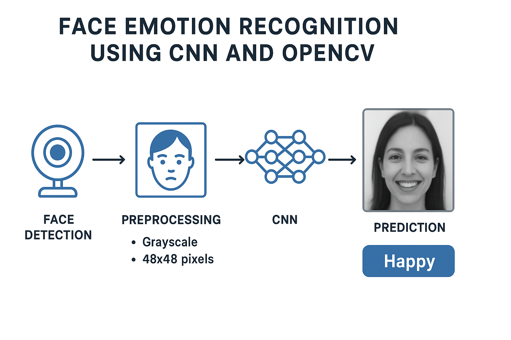
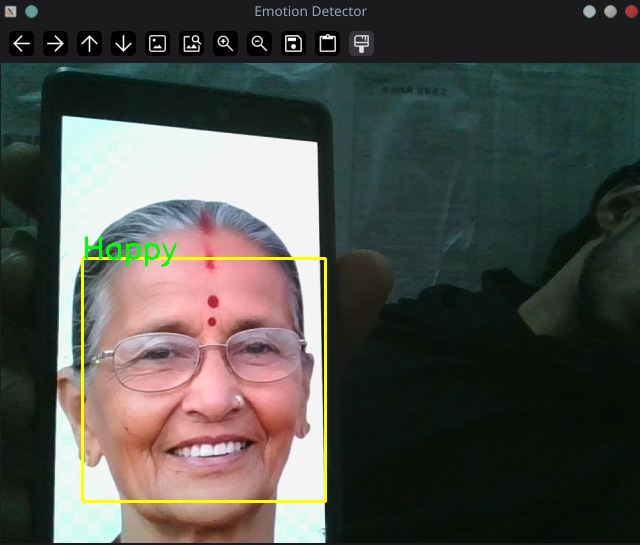

# Face Emotion Recognition Using CNN and OpenCV



## Description

This project implements a real-time **face emotion recognition system** using a **Convolutional Neural Network (CNN)** and **OpenCV**. It detects human faces in video frames and classifies their emotions such as Angry, Disgust, Fear, Happy, Neutral, Sad, and Surprise.

The system uses OpenCV’s **Haar Cascade Classifier** for face detection, preprocesses the face images to grayscale 48x48 pixels, normalizes pixel values, and feeds them into a CNN trained for emotion classification. Predicted emotions are displayed on the video feed in real-time.

**Note:** The current model achieves an accuracy of approximately **0.5**. This project was primarily for understanding and practice purposes, so there is plenty of room for improvement.

---

## Features

* Real-time face detection using webcam
* Emotion recognition for seven categories
* Grayscale image preprocessing and normalization
* Visual display of predicted emotion on video frames

---




## Tips to Improve Accuracy

1. **Data Augmentation**: Use rotation, flipping, zooming, or brightness changes to make the model robust to variations.
2. **Increase Dataset Size**: Train on a larger and more diverse dataset of facial expressions.
3. **Model Architecture**: Experiment with deeper CNNs or pre-trained models (like VGGFace or ResNet).
4. **Regularization**: Use dropout, batch normalization, or L2 regularization to prevent overfitting.
5. **Hyperparameter Tuning**: Adjust learning rate, batch size, number of epochs, and optimizer for better performance.

---

## Uses of Face Emotion Detection

* Human-computer interaction (adaptive interfaces)
* Sentiment analysis in marketing and UX research
* Mental health monitoring
* Security and surveillance systems
* Robotics and virtual assistants

---

## How to Run

1. Clone the repository.
2. Install required libraries:

```bash
pip install tensorflow opencv-python numpy
```

3. Ensure `haarcascade_frontalface_default.xml` and the trained model (`base.h5`) are in the project directory.
4. Run the main script:

```bash
python main.py
```

5. The webcam feed will open, detecting faces and showing predicted emotions in real-time. Press `q` to quit.

---

## Disclaimer

This project is for **educational and practice purposes only**. The current accuracy is limited, and the model is not intended for critical applications without further improvements.

